# 📚 The Knowledge Hub — Library Management System

A desktop-based Library Management System built with **C# (WinForms)**, developed as a project for the **OOP2 (Object-Oriented Programming II)** course. It automates day-to-day library operations — book cataloging, member management, issue/return tracking, billing, and user role management — through a clean, menu-driven interface.


---

## ✨ Features

- 🔐 **Role-based Login** — Admin and Librarian roles with separate access levels
- 📊 **Dashboard** — Live stats: total books, total issued, today's issues, overdue books, total income, total members
- 📖 **Book Management** — Add, update, delete, and search books (title, author, publisher, ISBN, category, shelf location, quantity)
- 🔄 **Issue / Return System** — Issue books with auto-generated bill numbers, due dates, cost calculation, discounts, and penalty tracking on late returns
- 🧑‍🤝‍🧑 **Member Management** — Add, update, delete, and search library members with full contact & address details
- 👤 **User Management** — Manage staff accounts with roles (Admin/Librarian)
- 🙍 **Profile & Password Management** — Each user can view their profile and change their password securely

---

## 🖥️ Screenshots

### Dashboard
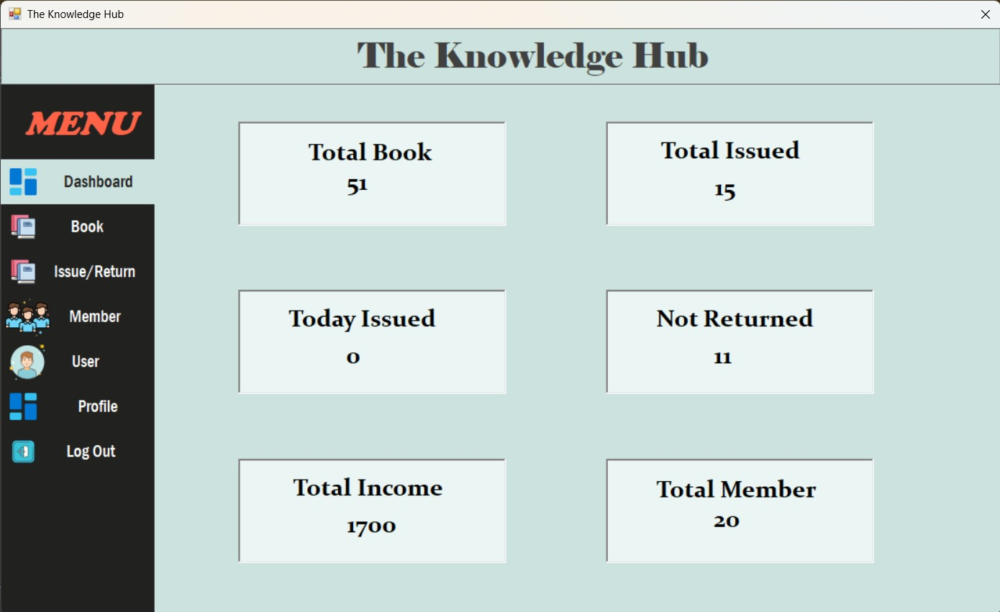

### Book List
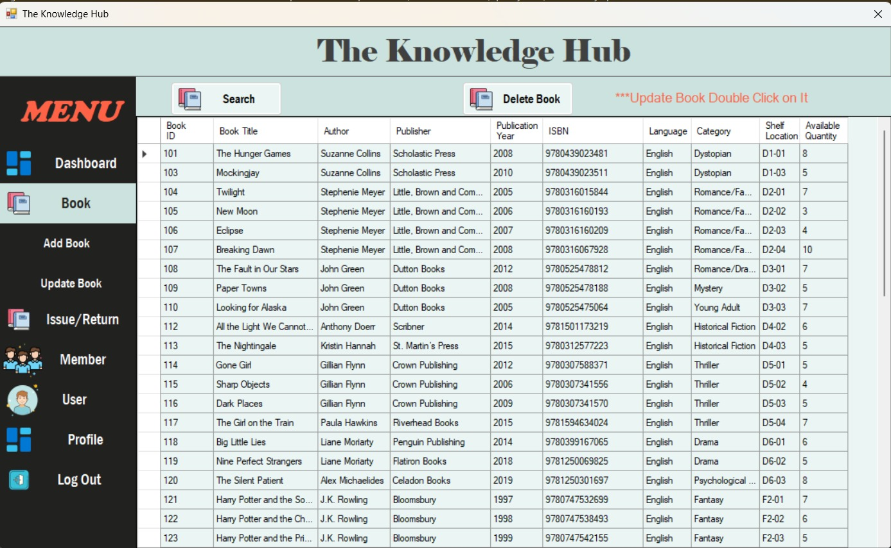

### Add Book
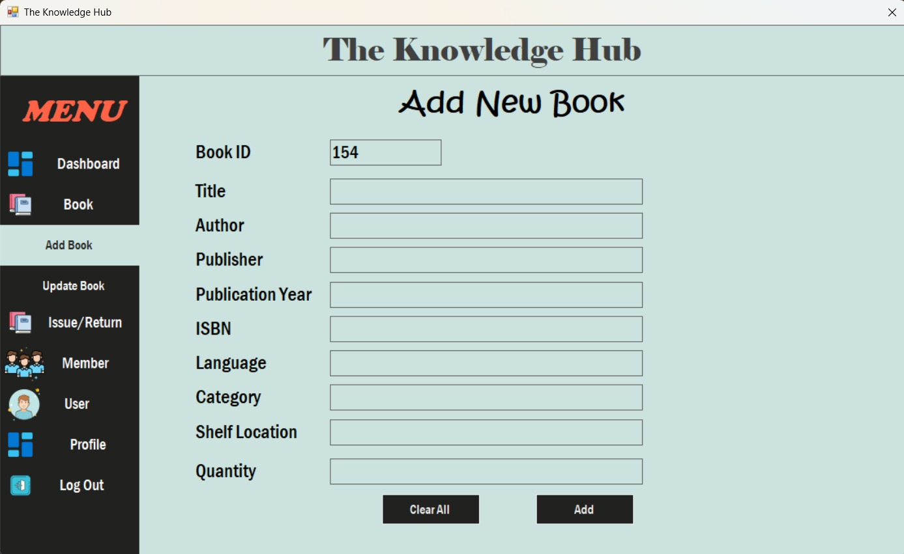

### Update Book
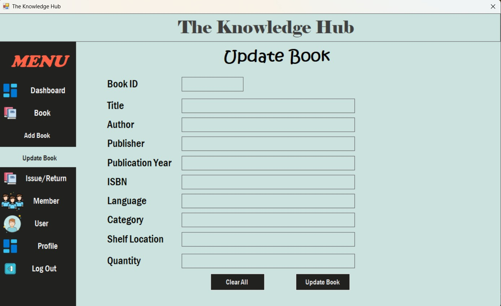

### Issue Book
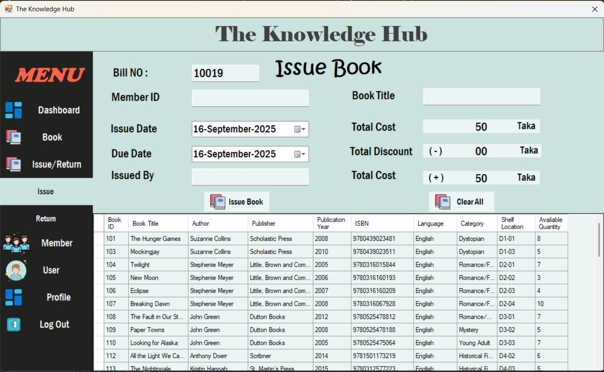

### Issue List
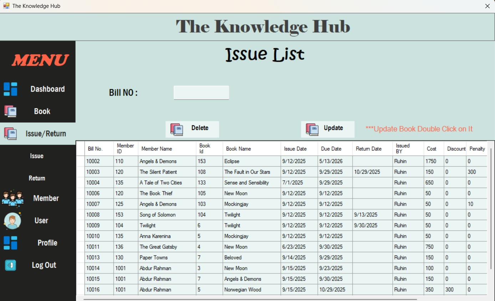

### Return Book
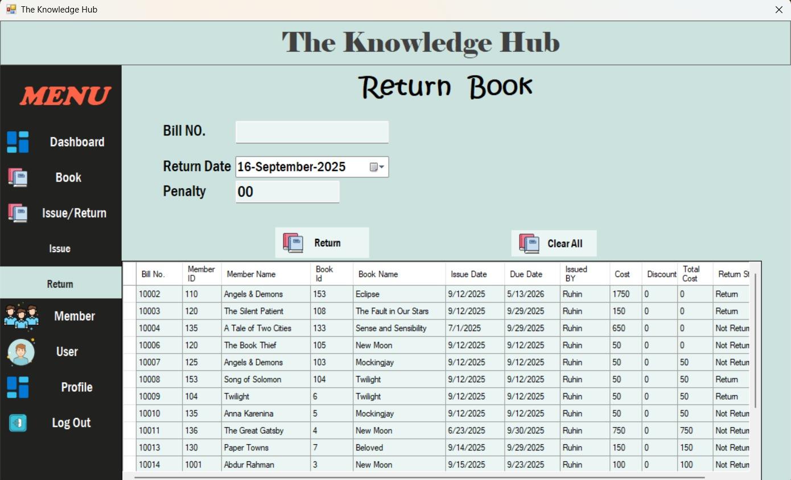

### Member List
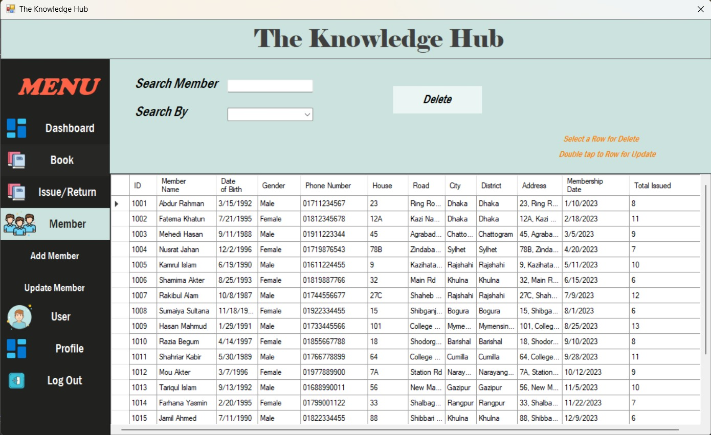

### Add Member
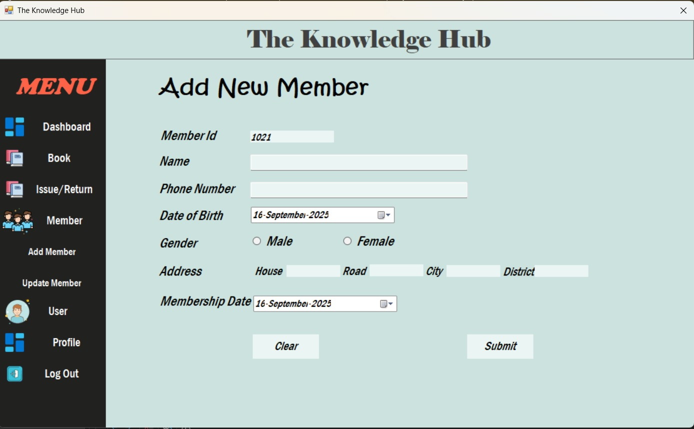

### Update Member
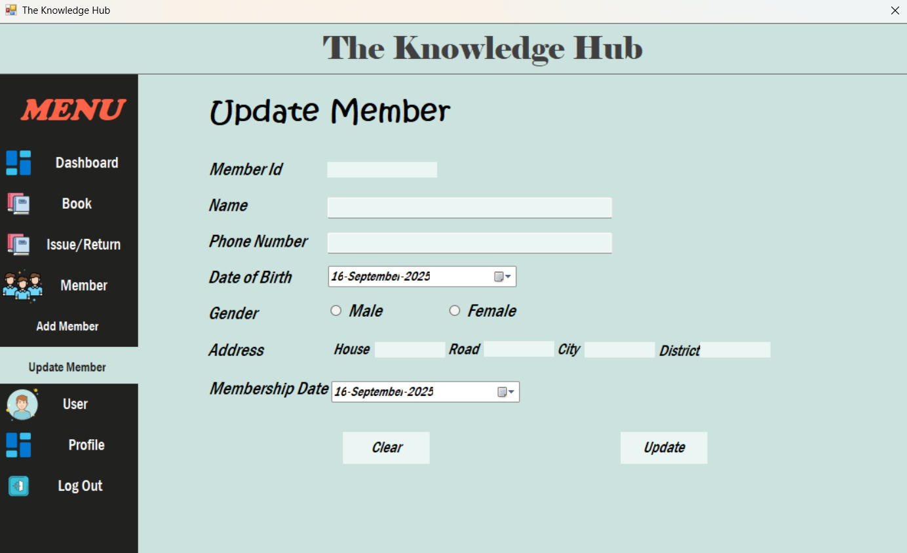

### User List
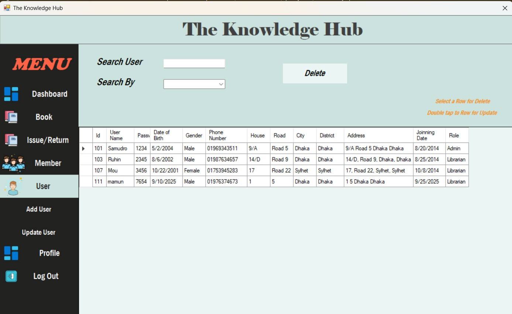

### Add User
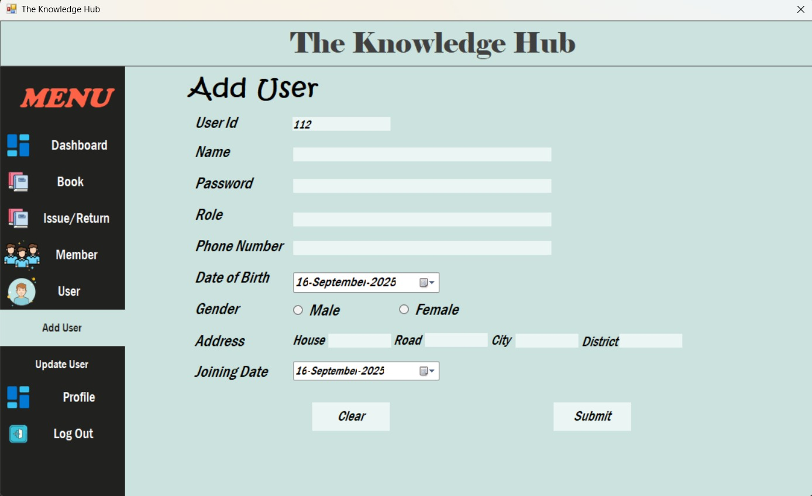

### Update User
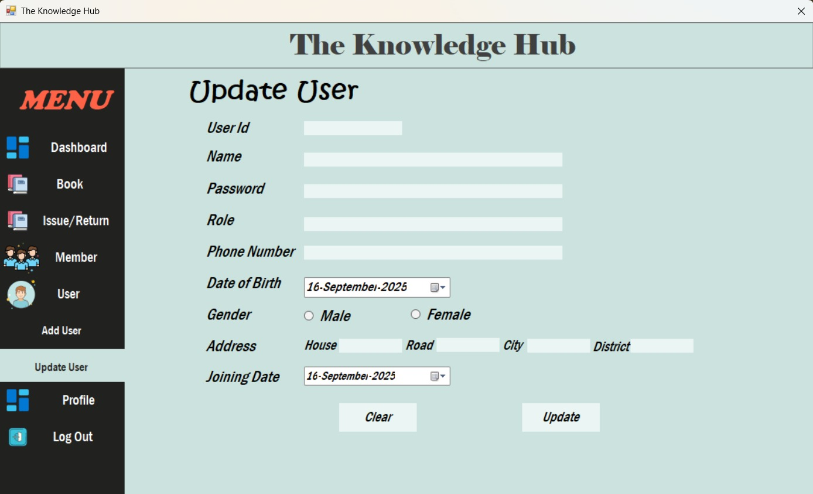

### Profile
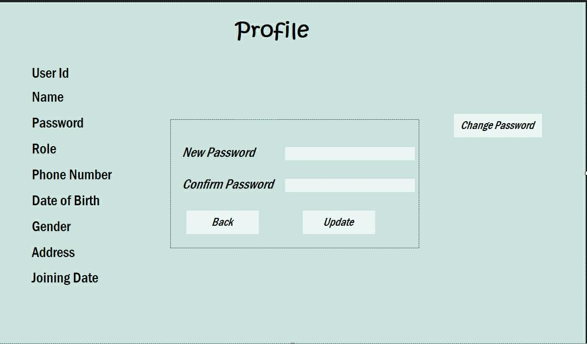

---

## 🛠️ Tech Stack

| Component        | Technology                     |
|------------------|---------------------------------|
| Language         | C#                              |
| UI Framework     | Windows Forms (WinForms)        |
| Database Access  | ADO.NET (`DataAccess.cs`)       |
| IDE              | Visual Studio                   |

## 📁 Project Structure

```
The Knowledge Hub/
├── LoginForm.cs / .Designer.cs        # Login screen
├── Dashboard.cs / .Designer.cs        # Main dashboard with live stats
├── NavigationMenu.cs / .Designer.cs   # Sidebar navigation
├── Books.cs / .Designer.cs            # Book list & search
├── AddBook.cs / .Designer.cs          # Add new book
├── UpdateBook.cs / .Designer.cs       # Update/edit book
├── IssueReturn.cs / .Designer.cs      # Issue/Return module entry
├── ShowIssue.cs / .Designer.cs        # Issue list view
├── Return.cs / .Designer.cs           # Return book form
├── BillWindow.cs / .Designer.cs       # Billing / invoice window
├── Members.cs / .Designer.cs          # Member list & search
├── AddMember.cs / .Designer.cs        # Add new member
├── Update Member.cs / .Designer.cs    # Update member
├── Users.cs / .Designer.cs            # User (staff) list
├── AddUser.cs / .Designer.cs          # Add new user/staff
├── Updateuser.cs / .Designer.cs       # Update user/staff
├── Profile.cs / .Designer.cs          # Logged-in user profile
├── DataAccess.cs                      # Centralized DB access layer
├── Program.cs                         # Application entry point
└── The Knowledge Hub.sln / .csproj    # Solution & project files
```

## 🚀 Getting Started

### Prerequisites
- Windows OS
- Visual Studio 2019 or later (with .NET Desktop Development workload)
- SQL Server (LocalDB or full instance) for the database

### Installation & Run
```bash
git clone https://github.com/Ruhin10/Library-Management-System.git
cd Library-Management-System
```
1. Open `The Knowledge Hub.sln` in Visual Studio.
2. Update the connection string in `DataAccess.cs` (or `App.config`) to point to your SQL Server instance.
3. Restore/build the solution (`Ctrl+Shift+B`).
4. Run the project (`F5`) — the Login screen will launch first.

## 👥 Contributors

- **Ruhin** and team — OOP2 Course Project (Group project)

## 📄 License

This project was developed for academic purposes as part of the OOP2 course.
